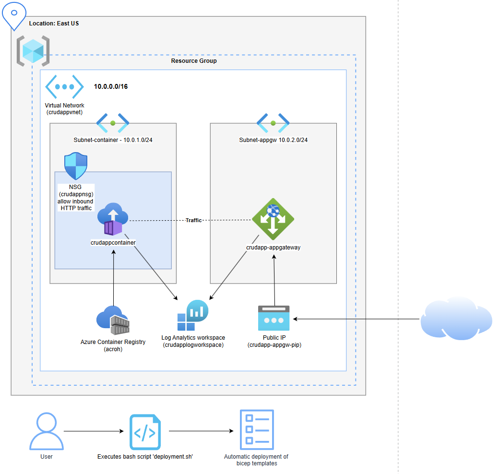

# Assignment 2: Azure Infrastructure-as-Code (10% PE) - Cloud Platforms

## Introduction
This project was made by Otis Hoymans, a second year Cloud & Cybersecurity student at Thomas More Geel. It focuses on deploying a CRUD application to Azure using Infrastructure-as-Code (IaC) principles with Bicep templates. The goal is to design and implement a cloud-based deployment architecture while following the best IaC practices to automate the process as much as possible.

## Azure Design Diagram



## Architecture Components

### Networking
- **Virtual Network (10.0.0.0/16)**: Primary network that isolates all deployment resources
- **Container Subnet (10.0.1.0/24)**: Dedicated subnet with ACI delegation for container instances
- **App Gateway Subnet (10.0.2.0/24)**: Separate subnet for the Application Gateway
- **Network Security Group**: Controls traffic flow with rules allowing HTTP (port 80) inbound traffic

### Compute & Container Resources
- **Azure Container Registry (Basic tier)**: Stores and manages the container image securely
- **Container Instance**: Linux-based container running with 1 CPU and 1GB memory allocation
- **Container Image**: Custom Flask CRUD application based on the example repository

### Access & Security
- **Application Gateway**: Provides public access, load balancing, and routing
- **Public IP Address (Static)**: Enables external access to the application
- **NSG Rules**: Enforces security by allowing only necessary traffic

### Monitoring
- **Log Analytics Workspace**: Collects and stores container logs for 30 days

## How the Application Works
The application is a Flask-based CRUD app created by Gürkan Akdeniz (https://github.com/gurkanakdeniz/example-flask-crud) running inside a Docker container, deployed to Azure using Azure Container Instances (ACI). It allows users to perform Create, Read, Update, and Delete (CRUD) operations via a web interface. The application is exposed to the internet via an Azure Application Gateway, which routes traffic to the container instance securely.

## Bicep Template Structure
- **acr.bicep**: Creates and configures the Azure Container Registry
- **infra.bicep**: Deploys network infrastructure, security, and monitoring components
- **app.bicep**: Provisions the container instance and Application Gateway
- **main.bicep**: Orchestrates the deployment of all modules

## Deployment Instructions

### Prerequisites
- Azure CLI installed and logged in
- Docker installed locally
- Access to a bash terminal

### Running the Deployment Script
To deploy the application, execute the provided `deployment.sh` script:

```sh
sh deployment.sh
```

This script will:
1. **Create a Resource Group**: All Azure resources will be deployed inside `crudapp-rg`.
2. **Deploy Azure Container Registry (ACR)**: The script deploys `acr.bicep` to create the ACR.
3. **Log in to ACR**: Ensures access to push the container image.
4. **Build and Push the Image**: Builds the Docker container image and uploads it to ACR.
5. **Deploy the Infrastructure and Application**: Deploys `main.bicep`, which provisions all required resources, including networking and application deployment.

### Accessing the Application
Once deployed, retrieve the public IP address of the application gateway:

```sh
az network public-ip list --resource-group crudapp-rg --query "[].{name:name, ipAddress:ipAddress}" --output table
```

Then, open your browser and navigate to:
```
http://<public-ip>
```

## Resource Optimization
- Container instances are configured with minimal but sufficient resources (1 CPU, 1GB RAM).
- Log retention is set to 30 days to balance monitoring needs with cost efficiency.
- Basic tier ACR is used.

## Security Implementation
- Private IP for container instances, not directly exposed to the internet.
- App Gateway serves as a security boundary for incoming traffic.
- NSG rules restrict traffic to only necessary ports.
- All resources deployed within isolated virtual network segments.
